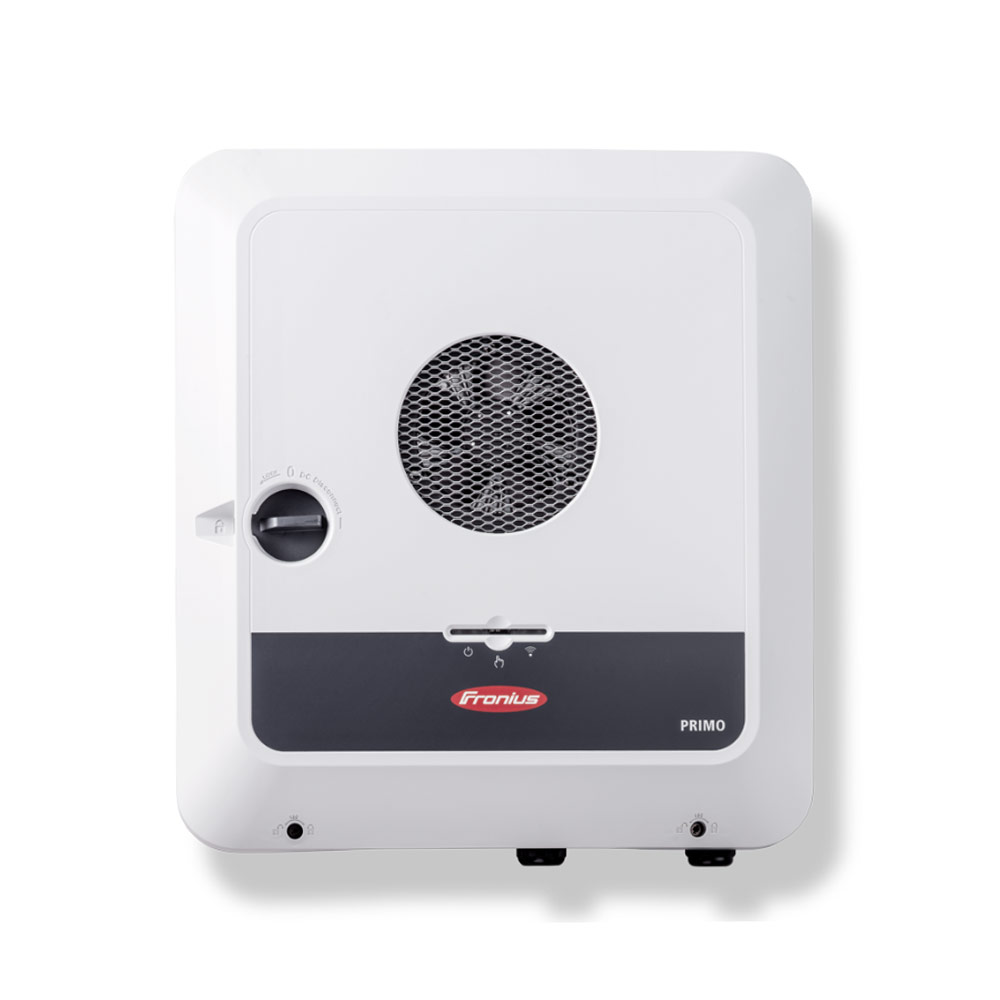
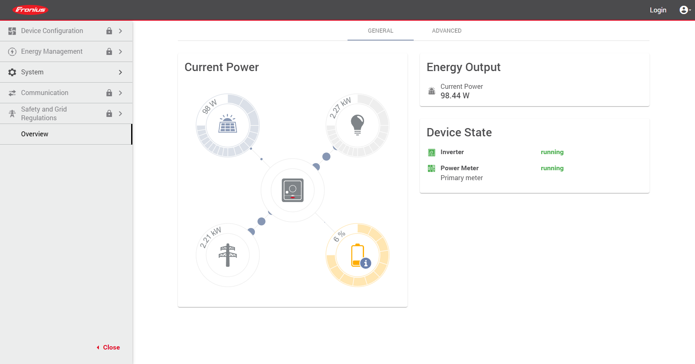
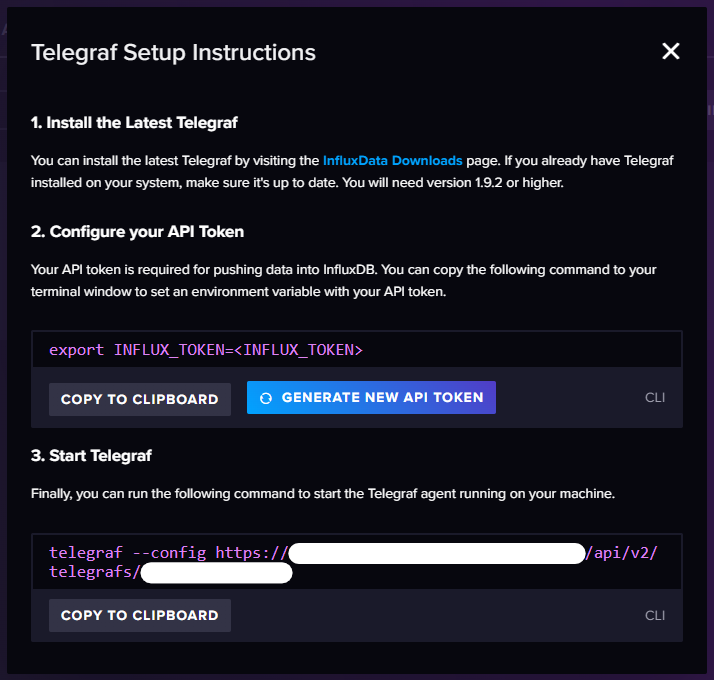
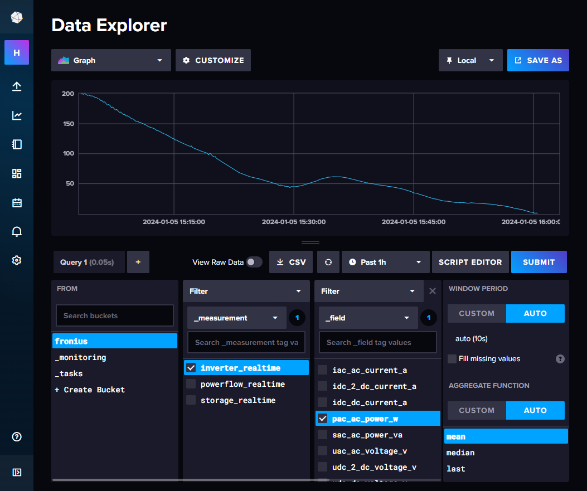
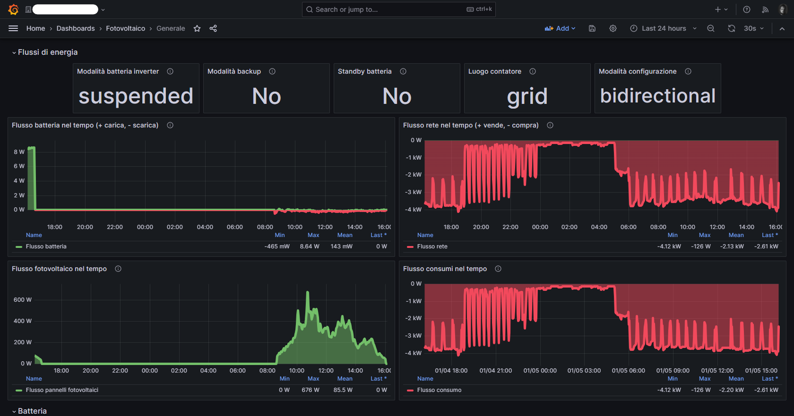
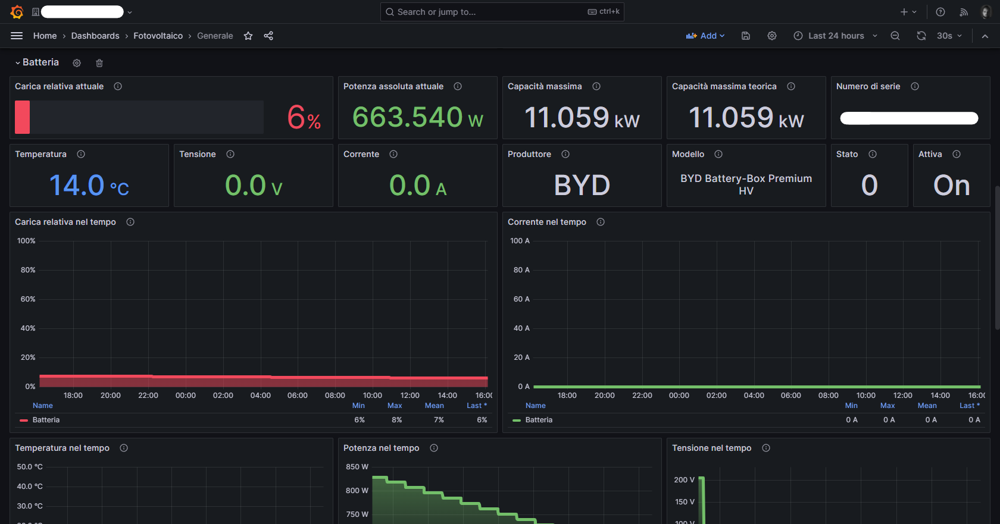
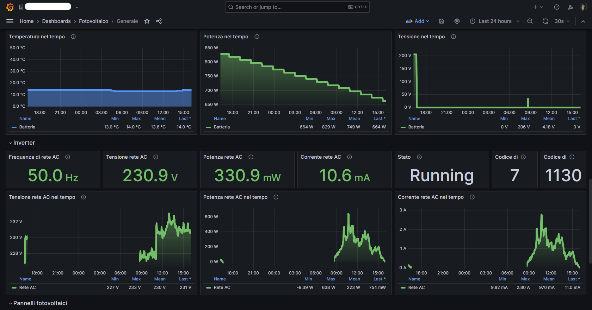
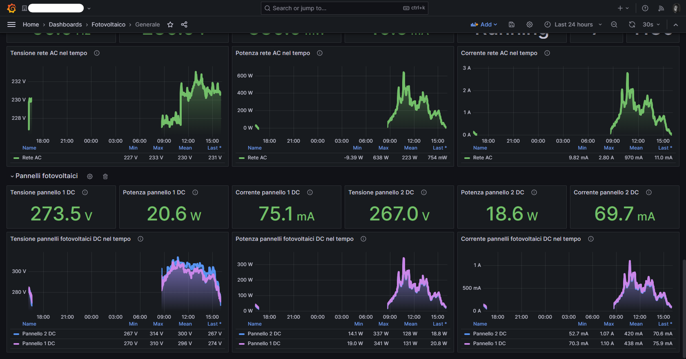

+++
date = 2024-01-05T15:09:34+01:00
title = "Importing Fronius inverter data into InfluxDB and Grafana"
description = "Some inverter from the brand Fronius can expose their data via some HTTP APIs, making it possible to analyze them further by storing them in a timeseries database and visualizing them."
authors = ["Stefano Previato"]
tags = ["Fronius", "inverter", "InfluxDB", "Grafana", "data"]
categories = ["InfluxDB", "Grafana", "Data"]
+++

## Preface

My in-laws recently upgraded their home's electrical system, and also installed a new inverter along with some batteries for the solar panels they installed on the roof of their house.



What caught my eye was that the inverter came with an app that you could download on your smartphone to have a look at all the current stats of the system, like battery charge, usage and solar production, but it had no historical features (or better, they were not so interesting because didn't allow to analyze data past a certain point in time).



So I started looking around the internet for some documentation, and found out you can actually read the same real time data by calling some HTTP endpoints exposed by the inverter itself! The inverter is in fact connected to the local network, and the app is just a visualization tool that asks the current data via the local network. This is different than other implementations I've seen around, where the data is not actually exposed by the device, but rather it is sent to a cloud service, where you have to pay to see what they are receiving from your device. Crazy, right? You own the device, but the data is not yours and it's behind a paywall.

Here's the documentation if you want to take a look at it: [Fronius Solar API v1](fronius_solar_api_v1.pdf)

## Requirements

TLDR:

- enable HTTP API in the inverter web settings (you need your electrician for this)
- install and setup InfluxDB
- install and setup Grafana
- install and setup Telegraf

Since Fronius seems to be a more serious organization, they allow you to see the data exposed by their inverter, but first you have to call the electrician that installed the system to ask them to enable this feature on your device. This is because otherwise you would not be able to get replies from the Fronius HTTP API. From what I've seen, there's no need for the electrician to come to your home, he just needs remote access to login into the device and unlock the feature using his "supervisor" credentials.

Once enabled, you should be able to go to the local address of the inverter (you can look it up by reading the MAC address on the device itself and then looking into your router what's the IP), or you may be even luckier and just be able to go to http://fronius if mDNS is working on your network.

At this point, you need a working instance of InfluxDB (our timeseries database of choice), Telegraf (our collecting agent of choice) and Grafana (our visualization tool of choice). There are plenty of guides that will help you set them up.

Personally, for this specific project I'm running InfluxDB v2.7.3 and Grafana Enterprise v10.2.0 as Docker containers on a cloud VPS machine, and Telegraf v1.29.1 on a little NUC machine installed at my in-laws connected to their network.

## Telegraf configuration

To collect data, I used Telegraf since it's very powerful and stable and I set up a new Telegraf configuration on my InfluxDB instance.

Since there's a lot of data that can be pulled out from the inverter, you can save some time and copy my configuration below:

```yaml
[agent]
  interval = "10s"
  round_interval = true
  metric_batch_size = 1000
  metric_buffer_limit = 10000
  collection_jitter = "0s"
  flush_interval = "10s"
  flush_jitter = "0s"
  precision = ""

[[outputs.influxdb_v2]]
  urls = ["https://your-influxdb-instance-url"] # replace with your InfluxDB instance URL
  token = "$INFLUX_TOKEN" # this will be injected via env variables on the Telegraf machine
  organization = "your-influxdb-org" # replace with your InfluxDB organization name
  bucket = "fronius" # replace with your InfluxDB bucket name

[[inputs.http]]
  urls = ["http://fronius/solar_api/v1/GetInverterRealtimeData.cgi?Scope=Device&DeviceId=1&DataCollection=CommonInverterData"]
  data_format = "json_v2"

  [[inputs.http.json_v2]]
    measurement_name = "inverter_realtime"

  [[inputs.http.json_v2.field]]
    path = "Body.Data.PAC.Value"
    rename = "pac_ac_power_w"

  [[inputs.http.json_v2.field]]
    path = "Body.Data.SAC.Value"
    rename = "sac_ac_power_va"

  [[inputs.http.json_v2.field]]
    path = "Body.Data.IAC.Value"
    rename = "iac_ac_current_a"

  [[inputs.http.json_v2.field]]
    path = "Body.Data.UAC.Value"
    rename = "uac_ac_voltage_v"

  [[inputs.http.json_v2.field]]
    path = "Body.Data.FAC.Value"
    rename = "fac_ac_frequency_hz"

  [[inputs.http.json_v2.field]]
    path = "Body.Data.IDC.Value"
    rename = "idc_dc_current_a"

  [[inputs.http.json_v2.field]]
    path = "Body.Data.UDC.Value"
    rename = "udc_dc_voltage_v"

  [[inputs.http.json_v2.field]]
    path = "Body.Data.IDC_2.Value"
    rename = "idc_2_dc_current_a"

  [[inputs.http.json_v2.field]]
    path = "Body.Data.UDC_2.Value"
    rename = "udc_2_dc_voltage_v"

  [[inputs.http.json_v2.field]]
    path = "Body.Data.DeviceStatus.ErrorCode"
    rename = "devicestatus_errorcode"

  [[inputs.http.json_v2.field]]
    path = "Body.Data.DeviceStatus.InverterState"
    rename = "devicestatus_inverterstate"

  [[inputs.http.json_v2.field]]
    path = "Body.Data.DeviceStatus.StatusCode"
    rename = "devicestatus_statuscode"

[[inputs.http]]
  urls = ["http://fronius/solar_api/v1/GetStorageRealtimeData.cgi?Scope=Device&DeviceId=0"]
  data_format = "json_v2"

  [[inputs.http.json_v2]]
    measurement_name = "storage_realtime"

  [[inputs.http.json_v2.field]]
    path = "Body.Data.Controller.Capacity_Maximum"
    rename = "capacity_maximum_w"

  [[inputs.http.json_v2.field]]
    path = "Body.Data.Controller.Current_DC"
    rename = "current_dc_a"

  [[inputs.http.json_v2.field]]
    path = "Body.Data.Controller.DesignedCapacity"
    rename = "designed_capacity_w"

  [[inputs.http.json_v2.field]]
    path = "Body.Data.Controller.Details.Manufacturer"
    rename = "manufacturer"

  [[inputs.http.json_v2.field]]
    path = "Body.Data.Controller.Details.Model"
    rename = "model"

  [[inputs.http.json_v2.field]]
    path = "Body.Data.Controller.Details.Serial"
    rename = "serial"

  [[inputs.http.json_v2.field]]
    path = "Body.Data.Controller.Enable"
    rename = "enable"

  [[inputs.http.json_v2.field]]
    path = "Body.Data.Controller.StateOfCharge_Relative"
    rename = "charging_state_relative_percent"

  [[inputs.http.json_v2.field]]
    path = "Body.Data.Controller.Status_BatteryCell"
    rename = "battery_cell_status"

  [[inputs.http.json_v2.field]]
    path = "Body.Data.Controller.Temperature_Cell"
    rename = "temperature_cell_c"

  [[inputs.http.json_v2.field]]
    path = "Body.Data.Controller.Voltage_DC"
    rename = "voltage_dc_v"

[[inputs.http]]
  urls = ["http://fronius/solar_api/v1/GetPowerFlowRealtimeData.fcgi"]
  data_format = "json_v2"

  [[inputs.http.json_v2]]
    measurement_name = "powerflow_realtime"

  [[inputs.http.json_v2.field]]
    path = "Body.Data.Inverters.1.Battery_Mode"
    rename = "inverter_battery_mode"

  [[inputs.http.json_v2.field]]
    path = "Body.Data.Inverters.1.P"
    rename = "inverter_p"

  [[inputs.http.json_v2.field]]
    path = "Body.Data.Inverters.1.SOC"
    rename = "inverter_soc"

  [[inputs.http.json_v2.field]]
    path = "Body.Data.Site.BackupMode"
    rename = "site_backup_mode"

  [[inputs.http.json_v2.field]]
    path = "Body.Data.Site.BatteryStandby"
    rename = "site_battery_standby"

  [[inputs.http.json_v2.field]]
    path = "Body.Data.Site.Meter_Location"
    rename = "site_meter_location"

  [[inputs.http.json_v2.field]]
    path = "Body.Data.Site.Mode"
    rename = "site_mode"

  [[inputs.http.json_v2.field]]
    path = "Body.Data.Site.P_Akku"
    rename = "site_power_batteries_w"

  [[inputs.http.json_v2.field]]
    path = "Body.Data.Site.P_Grid"
    rename = "site_power_grid_w"

  [[inputs.http.json_v2.field]]
    path = "Body.Data.Site.P_Load"
    rename = "site_power_load_w"

  [[inputs.http.json_v2.field]]
    path = "Body.Data.Site.P_PV"
    rename = "site_power_panels_w"

  [[inputs.http.json_v2.field]]
    path = "Body.Data.Site.rel_Autonomy"
    rename = "site_autonomy_percent"

  [[inputs.http.json_v2.field]]
    path = "Body.Data.Site.rel_SelfConsumption"
    rename = "site_self_consumption_percent"
```

This configuration pulls all the useful data from the real time endpoints every 10 seconds and stores them into the InfluxDB configured instance in three separate measurements, each with friendly field names.

You will need to replace the URL in each of the three endpoints if yours cannot be resolved via http://fronius (I had to use a static IP because name resolution was a bit brittle in my in-laws network for some reason, so I configured a static lease in the router and just used the IP in each URL).

Disclaimer: I have to admit I don't really know what some of the fields represent, but I tried to understand them by looking at what the WebUI exposed and what I could see in the API calls, and researching a bit over the internet if I could find anything useful. A couple of fields seem to represent enums or something like that, but I couldn't find each possible value in the documentation.

Once you have saved the Telegraf configuration, click on "Setup instructions" in the InfluxDB UI and follow the instructions, also generating a new API token if you don't already have one:



If you want to run this as a one-time test, you can do as the instructions say.

I wanted this to be a permanent thing, so I set up a systemd service in the NUC machine that will run the Telegraf instance. Here's the config file of the unit:

```ini
[Service]
ExecStart=
ExecStart=/usr/bin/telegraf --config https://your-url-above/api/v2/telegrafs/your-telegraf-id-above $TELEGRAF_OPTS
Environment="INFLUX_TOKEN=your_influx_token_above"
```

We're done!

If everything is working correctly, you should start seeing data come in into your InfluxDB bucket:



## Grafana dashboard

At this point you can connect to your Grafana instance and create some cool visualizations.

If you speak Italian, here's what I created for this project, you may find it useful for your project too or as a starting point for something more complex:









If you want to download it as a JSON file that you can import in your Grafana instance, here's the file: [Grafana dashboard JSON file](grafana_dashboard.json)

## Conclusion

I love collecting data about stuff that we own, it helps us get more insights about the things we have and how we use them, and in this specific case it helps us make better use of green energy, which is always a nice thing to do these days.

If you end up doing something similar with your devices, let me know, I'd love to see what you can do.
